# showy-quota

Always-on AI plan quota strips for **[SketchyBar](https://github.com/FelixKratz/SketchyBar)**, **[Zellij](https://github.com/zellij-org/zellij)**, and **[tmux](https://github.com/tmux/tmux)**,
driven by [CodexBar](https://github.com/steipete/CodexBar).

Beautiful, themeable, minimal.

<p align="center">
  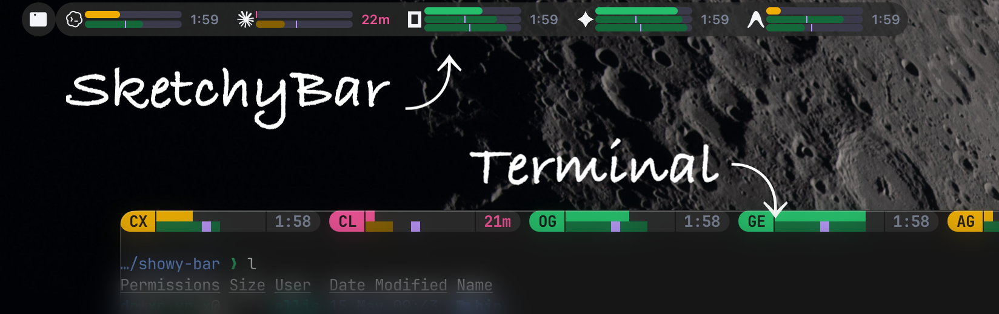
</p>

<p align="center"><sub>showy-quota running across SketchyBar and a Zellij terminal on macOS</sub></p>

<br>

<p align="center">
  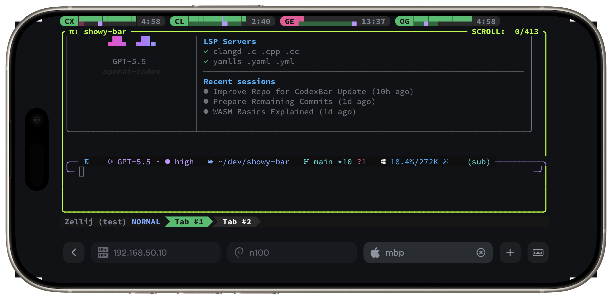
</p>

<p align="center"><sub>showy-quota's Zellij strip on an iPhone — four AI providers, real quotas, mid-session</sub></p>

---

```
codexbar serve → http://127.0.0.1:8080/health + /usage
       ▲
       │ auto-started by plugin/fetcher when absent
       │
       ├──► showy-quota-zellij.wasm              (standalone Zellij plugin)
       │
       ▼
bin/showy-quota-fetch     ←  shared cache + source marker + flock + last-known-good
       │  ~/.cache/showy-quota/usage.json + source
       ├──► bin/showy-quota-state                 (stable provider/layout state JSON)
       ├──► adapters/sketchybar/plugins/showy_quota.sh    (native SketchyBar rows + icons)
       ├──► bin/showy-quota-tmux-bar             (tmux #[…] markup for status-right)
       └──► bin/showy-quota-zellij-bar           (advanced zjstatus pipe segment)
```

### Features
- **Zero auth/config:** Relies entirely on CodexBar for credentials and parsing.
- **Provider status (SketchyBar):** Icons automatically tint yellow (minor/maintenance) or red (major/critical) during an outage. Clicking a degraded icon opens the provider's official status page.
- **Pacing & thresholds:** Renders proportional pacing markers where the surface supports them and color-codes usage (good/warn/bad) based on configurable remaining-quota and time thresholds.
- **Themeable:** Ships with Catppuccin, Nord, Dracula, Tokyo Night, and others.
- **Low overhead:** Host bars share one cached fetcher; Zellij can use a single WASM artifact.

## Quickstart

1. **Install and enable CodexBar.** It is the only thing that talks to providers.

   ```sh
   brew install --cask steipete/tap/codexbar          # macOS
   # CLI tarball / Linux: https://github.com/steipete/CodexBar/releases
   codexbar usage --format json | jq length           # should print 1 or more
   ```

   On macOS, cookie-based providers also need Full Disk Access for CodexBar in
   **System Settings → Privacy & Security**. If `jq length` prints `0`, fix
   CodexBar before continuing — showy-quota has nothing to paint without it.

2. **Install showy-quota for the UI you use.**

   Shell integrations (SketchyBar/tmux):

   ```sh
   git clone https://github.com/enieuwy/showy-quota && cd showy-quota
   make doctor                    # bash 4+, jq, codexbar present
   make install                   # symlinks bin/* into ~/.local/bin
   ```

   Zellij plugin from source:

   ```sh
   git clone https://github.com/enieuwy/showy-quota && cd showy-quota
   make install-plugin            # builds + installs showy-quota-zellij.wasm
   ```

   For Zellij-only installs from a release, you can skip the clone and download
   `showy-quota-zellij.wasm`; see [`docs/plugin.md`](docs/plugin.md).
   `make install` and `make install-plugin` refuse to clobber existing files
   unless you run with `FORCE=1`.

3. **Wire a UI.** Pick the UI(s) you use:

   - **SketchyBar:** `make install-sketchybar`, then add
     `source "$ITEM_DIR/showy_quota.sh"` to your `sketchybarrc` and reload.
   - **tmux:** use the TPM wrapper or paste the snippet in
     [tmux wiring](#tmux-wiring) into `~/.tmux.conf`.
   - **Zellij:** install `showy-quota-zellij.wasm`, paste the layout fragment.
     See [`docs/zellij.md`](docs/zellij.md) and [`docs/plugin.md`](docs/plugin.md).

### SketchyBar wiring

Install the SketchyBar item/plugin, then add the item declaration to
`~/.config/sketchybar/sketchybarrc` after `ITEM_DIR` and `PLUGIN_DIR` are
defined:

```sh
make install-sketchybar
source "$ITEM_DIR/showy_quota.sh"
```

Then reload SketchyBar (`sketchybar --reload` or quit + relaunch) once to
load the trigger item. One icon + bar + label triple appears per provider
currently fetching usage data; later provider adds/removals land on the next
plugin tick without another reload.

### Zellij wiring

Two pieces:

1. **Plugin pane** — install `showy-quota-zellij.wasm` and paste
   `adapters/zellij/layout-pane.kdl.fragment` into your default layout. It
   declares one visible standalone plugin pane; no `zjstatus` or feeder loop is
   needed.
2. **Detail keybind** — paste `adapters/zellij/detail-pane.kdl.fragment` into your
   keybinds block. Default is `Alt /`.

Reload Zellij to pick up the new layout/keybind. Advanced users who want
showy-quota inside an existing multi-widget zjstatus row can keep using
`showy-quota-zellij-pipe`; see [`docs/zellij.md`](docs/zellij.md).

### tmux wiring

TPM users can install the wrapper directly:

```tmux
set -g @plugin 'enieuwy/showy-quota'

# Optional: bind the detail popup. Pick any prefix-relative key you prefer.
set -g @showy-quota-popup-key '/'
```

The TPM wrapper adds the existing `bin/showy-quota-tmux-bar` renderer to
`status-right`; it does not introduce a second tmux implementation. Without
TPM, wire the same renderer manually:

```sh
# Use the absolute path — tmux's PATH at server start typically lacks ~/.local/bin.
CB_BIN="$HOME/.local/bin"
cat >> ~/.tmux.conf <<TMUX
set -g status-right-length 300
if -F '#{m:*showy-quota-tmux-bar*,#{status-right}}' '' 'set -ag status-right " #(${CB_BIN}/showy-quota-tmux-bar)"'
bind-key "/" display-popup -E -h 36 -w 92 -T "CodexBar usage" 'config="\${XDG_CONFIG_HOME:-\$HOME/.config}/showy-quota/config.env"; [ -r "\$config" ] && . "\$config"; while :; do clear; "\${SHOWY_QUOTA_CODEXBAR_BIN:-codexbar}" usage; sleep 30; done'
TMUX
tmux source ~/.tmux.conf
```

No `watch(1)` dependency — the popup uses a tiny shell loop so this works on a
stock macOS install.

### Terminal rendering modes

Terminal strips default to an `auto` mode that picks a body layout per
provider:

- **`dual`** (default for most providers): a primary-over-secondary
  half-block layout. Each window is colored by its remaining-quota severity
  and dimmed when it is a weekly/monthly cap; both rows show a pacing marker
  (the `elapsed` color tints the upper half for the primary window and the
  lower half for the secondary). Body width is 12 cells.
- **`mono3`** (default for `gemini`, `cursor`): packs primary,
  secondary, and tertiary into a single sextant cell per column with
  top/middle/bottom rows. Uses a single provider-level foreground color
  and `mono_markers` pacing separators. Providers whose windows share one
  billing cycle (same reset and window length, e.g. Cursor's Total/Auto/API)
  stay at full brightness and show a single pacing marker.
- **`mono4`** (opt-in): packs four per-pool windows (e.g. Antigravity's
  Gemini and Claude+GPT session/weekly pools, from `extraRateWindows`) into
  a single octant cell per column. Like `mono3` but four lanes — requires an
  octant-capable terminal (Ghostty, kitty, WezTerm); run
  `python3 docs/scripts/preview-quad-octants.py` to test yours.
- **`dual2`** (auto-detected for model-pooled providers like `antigravity`):
  splits the provider into one standalone `dual` per pool (`AGᴳ` for Gemini,
  `AGᶜ` for Claude+GPT), each from `extraRateWindows` and rendered by the
  normal half-block `dual` path. Half-blocks render in every terminal (unlike
  `mono4`). `auto` engages the split when a provider's extras carry all its
  positional slots; a single pool stays one plain `dual` (Antigravity via OAuth
  reports only Gemini). Force the split per provider with
  `SHOWY_QUOTA_PROVIDER_MODES=<provider>=dual2`.

<p>
  
</p>

Customize terminal layout with `SHOWY_QUOTA_TERMINAL_BAR_MODE=dual|dual2|mono3|mono4`.
For per-provider auto-mode selection and marker behavior, use
`SHOWY_QUOTA_PROVIDER_MODES` (e.g. `antigravity=mono4`),
`SHOWY_QUOTA_MONO_COLOR_MODE`, and `SHOWY_QUOTA_MONO_MARKERS`.

Stuck? `bin/showy-quota --diagnose` (or `make diagnose`) prints exactly the
state a bug report needs; `bin/showy-quota --diagnose --json` emits the same
diagnostic surface as stable machine-readable JSON.

## Requirements

- **macOS** for SketchyBar. Zellij/tmux bars also work on Linux when CodexBar
  can fetch your chosen providers.
- A CodexBar data source:
  - Zellij plugin: `codexbar` on the Zellij server `PATH`; the plugin starts
    `codexbar serve` by default, uses `/health` + `/usage`, and visibly marks
    CLI fallback as `⚠cli`;
  - shell integrations: same managed serve path via `showy-quota-fetch`, with
    visible `⚠cli` fallback.
  CodexBar's web-backed providers remain macOS-only; CLI/OAuth/API/local
  providers work where CodexBar supports them.
- Shell integrations need `bash` 4+, `jq`, and a `date` that understands either
  `-j -f` (BSD/macOS) or `-d` (GNU coreutils).
  The standalone Zellij plugin does not need the shell scripts, `bash`, or `jq`.
- SketchyBar integration also needs `sketchybar` on the PATH. Font icon mode
  needs `sketchybar-app-font`; SVG fallback icons need ImageMagick 7+
  (`magick`). Native usage rows do not need `magick`.
- The Zellij/tmux renderers wrap each provider chunk in Powerline-Extra end
  caps (U+E0B6 / U+E0B4). Any Nerd Font ships these. For the standalone
  Zellij plugin with a non-Nerd font, set `cap_left ""` and `cap_right ""`
  in the plugin KDL; for tmux or advanced zjstatus, set
  `SHOWY_QUOTA_CAP_LEFT=` / `SHOWY_QUOTA_CAP_RIGHT=`. Terminal sextant modes
  have additional font notes in `docs/zellij.md` and `docs/tmux.md`.
- Optional: `flock` for inter-process locking; falls back to an owner-scoped
  `mkdir` lock when missing.
- Development/install commands are written for GNU-compatible `make`; on
  systems with a non-GNU default make, use `gmake` or invoke the scripts
  directly.

## Configuration

Every script reads optional overrides from `~/.config/showy-quota/config.env`.
The file is optional; create it only for values you want to override.

Most users only need these; the full environment surface lives in
[`share/config.env.example`](share/config.env.example).

| Variable | Default | Effect |
|---|---|---|
| `SHOWY_QUOTA_THEME` | unset (default palette) | Load a named built-in or user palette. |
| `SHOWY_QUOTA_PROVIDERS` | empty | Ordered provider allow-list; empty renders CodexBar's enabled providers. |
| `SHOWY_QUOTA_PROVIDERS_EXCLUDE` | empty | Provider deny-list applied after the allow-list. |
| `SHOWY_QUOTA_PROVIDER_ORDER` | `codex,claude,copilot,opencode,gemini` | Stable render order without filtering. |
| `SHOWY_QUOTA_REFRESH_SECONDS` | `120` | Slow CLI fallback refresh interval. |
| `SHOWY_QUOTA_MANAGE_SERVE` | `1` | Start `codexbar serve` automatically before CLI fallback; set `0` to disable. |
| `SHOWY_QUOTA_CODEXBAR_SERVE_URL` | `http://127.0.0.1:8080` | Local `codexbar serve` base URL; set empty to skip HTTP probing. |
| `SHOWY_QUOTA_CODEXBAR_SERVE_TIMEOUT_SECONDS` | `10` | Per-request timeout for local `/health` and `/usage` probes. |
| `SHOWY_QUOTA_CODEXBAR_SERVE_PORT` | `8080` | Port passed to managed `codexbar serve --port`. |
| `SHOWY_QUOTA_CODEXBAR_SERVE_REFRESH_SECONDS` | `10` | Refresh interval when `codexbar serve` is available. |
| `SHOWY_QUOTA_TIME_WARN_MINUTES` | `30` | Urgent countdown threshold. |
| `SHOWY_QUOTA_SKETCHYBAR_CLICK` | `open -b com.steipete.codexbar` | Default SketchyBar click action; degraded icons open provider status URLs. |

Palette overrides use role-first keys such as `SHOWY_QUOTA_PALETTE_PRIMARY_*`.
Secondary and tertiary row colors auto-derive from the primary palette at
`0.55` unless overridden; see `share/config.env.example` for the full palette
surface.

## Theme gallery

| theme name | SketchyBar image | terminal / Zellij image |
|---|---|---|
| `carbonfox` | 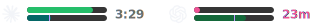 |  |
| `catppuccin-frappe` | 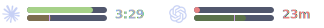 |  |
| `catppuccin-latte` | 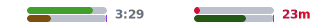 |  |
| `catppuccin-macchiato` | 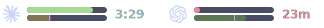 |  |
| `catppuccin-mocha` | 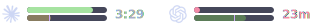 |  |
| `catppuccin-mocha-blue` | 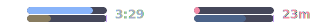 |  |
| `default` | 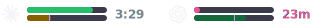 |  |
| `dracula` | 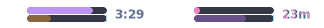 |  |
| `gruvbox-dark` |  |  |
| `nord` | 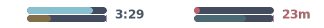 |  |
| `tokyonight` | 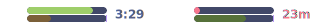 |  |

## Verification

```sh
make doctor      # check runtime prerequisites
make test        # smoke tests over JSON fixtures
make plugin      # build showy-quota-zellij.wasm
make diagnose    # printable bug-report state (`bin/showy-quota --diagnose --json` for JSON)
```

Cache lives at `${XDG_CACHE_HOME:-~/.cache}/showy-quota/usage.json`.
If that file is corrupt, the fetcher moves it aside as
`usage.json.corrupt.<epoch>.<pid>` and keeps only the newest few quarantine
files for diagnostics. `make clean` clears cache artifacts.

## How it stays cheap

- tmux, SketchyBar, and advanced zjstatus share one cached fetcher. It prefers
  `codexbar serve`, starts it when absent, and marks CLI fallback as `⚠cli`.
- The standalone Zellij plugin uses the same serve-first shape and keeps
  in-memory last-known-good output per pane.

## License

[MIT](LICENSE) — same as CodexBar.

## Credits

[CodexBar](https://github.com/steipete/CodexBar) by Peter Steinberger does
all the real work. This repo just paints its output onto status bars.
